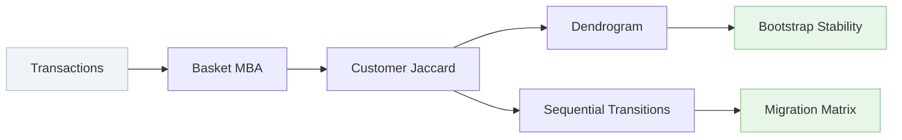

# ChoiceMap

> Clusters SKUs by who buys both across purchase histories —
> not what appears in the same basket. Produces a bootstrap-validated
> behavioral hierarchy with sequential exit tracking.

[](https://customer-choice-model.streamlit.app/)
[](https://www.python.org/)
[](https://pola.rs/posts/announcing-polars-2/)
[](LICENSE)

---

## Pipeline



> **Interpretation matters.** Customer overlap is not causal demand transference.
> Switching rates do not prove that removing one SKU drives customers to another.
> This is a behavioral clustering tool, not a demand model.

---

## Architecture

| File | Role |
|------|------|
| `engine.py` | Lazy Polars ingestion → sparse MBA + customer Jaccard → linkage + bootstrap → transition tracking |
| `visual.py` | 13 interactive Plotly figure factories built from saved artifacts |
| `app.py` | Streamlit app: upload or sample data, column mapping, 6 tabs, sanitized exports |

---

## App tabs

| Tab | Contents |
|-----|----------|
| Overview | SKU metrics table, coverage and fit summary |
| Choice tree | Dendrogram, similarity heatmap, branch stability bar, cluster evolution Sankey |
| Pair explorer | Any two SKUs with all basket and transition metrics side by side |
| Migration | Exit→new-selection rate matrix, top flows bar, CI error bars, retention/exit decomposition |
| SKU profiles | Penetration vs retention map, per-SKU KPI cards, transition funnel, relationship rankings |
| Downloads | Parquet exports, run metadata JSON, interactive HTML report |

---

## Quick start

```bash
python -m venv .venv && source .venv/bin/activate   # Windows: .venv\Scripts\Activate.ps1
pip install -r requirements.txt
```

> The `rtcompat` Polars extra targets CPUs without AVX support.
> Its correct spelling is `rtcompat`, not `rtcompact`.

Place the sample file at `sample_data/instacart_yogurt.parquet`, then:

```bash
python engine.py --input sample_data/instacart_yogurt.parquet --out output/yogurt
python visual.py --run output/yogurt --out output/yogurt/choice_map.html
streamlit run app.py
```

Fast iteration (40 SKUs, 5 bootstrap replicates):

```bash
python engine.py --input sample_data/instacart_yogurt.parquet \
    --out output/yogurt_quick --max-skus 40 --bootstrap 5
```

---

## Expected input

One row per product per order:

| Column | Required | Description |
|--------|----------|-------------|
| `user_id` | Yes | Customer identifier |
| `order_id` | Yes | Globally unique basket ID, one customer only |
| `product_id` | Yes | SKU identifier (int or string) |
| `order_number` | Yes (default) | Per-customer order sequence for transition tracking |
| `product_name` | No | Human-readable label; product ID used when absent |
| `aisle` | Under defaults | Category filter column |

Custom column mapping:

```python
from engine import Config, run

run(Config(
    input_path="data/transactions.parquet",
    out="output/my_category",
    user_col="customer_key",
    order_col="basket_key",
    product_col="sku_key",
    sequence_col="visit_number",
    category_col=None,
    category_value=None,
))
```

---

## How it works

```
1. INGEST       Lazy scan → category filter → dedup → integrity checks

2. METRICS      Sparse user×SKU and order×SKU matrices
                → customer Jaccard  (choice distance)
                → basket MBA        (lift, confidence, leverage)
                → hypergeometric overlap p-values (BH-adjusted)

3. TREE         Average-linkage clustering on choice distance
                → whole-customer bootstrap branch support
                → cophenetic correlation fit diagnostic

4. TRANSITIONS  Consecutive category-occasion self-join
                → exit / retained / migration / expansion counts
                → bootstrap confidence intervals on migration rates
```

Customer Jaccard — the core choice distance:

```
J(A, B) = shared_buyers(A, B) / [buyers(A) + buyers(B) − shared_buyers(A, B)]
```

Bootstrap stability resamples whole customers on each replicate. Branch support is the
fraction of resampled trees containing the exact same descendant set.

---

## Outputs

| File | Contents |
|------|----------|
| `sku_metrics.parquet` | Buyers, orders, penetration, retention and exit rates per SKU |
| `pair_metrics.parquet` | Basket, customer, migration, and expansion metrics per unordered pair |
| `tree_nodes.parquet` | Linkage children, merge heights, bootstrap support |
| `cluster_assignments.parquet` | SKU cluster membership at K = 4, 6, 8 |
| `cluster_profiles.parquet` | Within-cluster cohesion summary |
| `run.json` | Config, counts, coverage, leaf order, runtime, schema version |

```python
from visual import build_figures, load_run

data = load_run("output/yogurt")
tree, heatmap = build_figures("output/yogurt", cut=0.7)

# All 13 figure factories:
# _make_branch_stability        _make_repertoire_basket_scatter
# _make_sku_behavior_map        _make_cluster_evolution
# _make_migration_matrix        _make_migration_rank
# _make_migration_ci            _make_retention_exit_decomposition
# _make_sku_profile             _make_sku_relationship_rankings
# _make_transition_funnel
```

---

## CLI reference

| Flag | Default | Description |
|------|---------|-------------|
| `--input` | — | Input Parquet or CSV (required) |
| `--out` | `output/choice_run` | Output directory |
| `--category-col` | `aisle` | Column used to filter category |
| `--category` | `yogurt` | Category value to keep |
| `--min-buyers` | `30` | Minimum distinct buyers per SKU |
| `--max-skus` | `120` | Maximum SKUs retained |
| `--bootstrap` | `30` | Customer bootstrap replicates |
| `--linkage` | `average` | `average`, `complete`, or `single` |
| `--no-switching` | off | Disable sequential transition tracking |
| `--seed` | `42` | Random seed |
